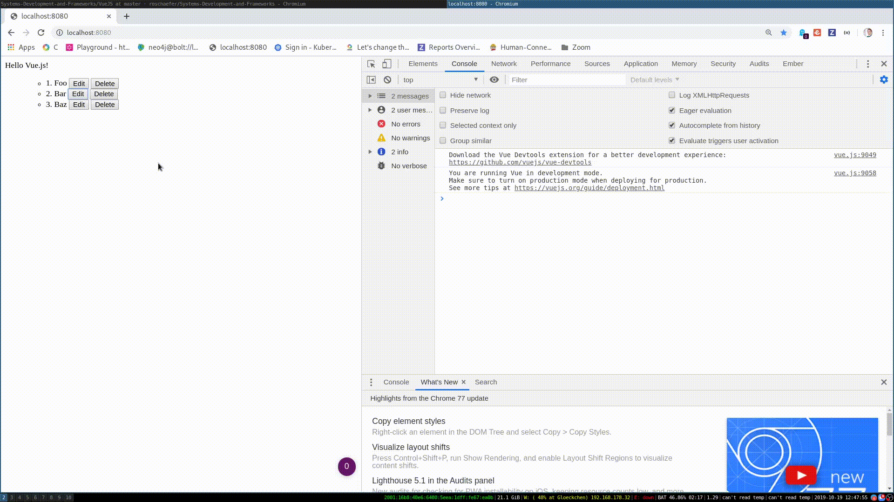

# Exercise \#1

Implement a simple todo app with VueJS.

Each item in the todo app should:

* Edit: display a form to update the todo
* Save: update the todo and display it
* Cancel: cancel the form submission
* Delete: delete the todo

Here is how the result should look like:



Use computed properties and events where possible and make use of the component
pattern.

Get extra praise for implementing the "Add todo" button! :heart:


## Build Setup

``` bash
# install dependencies
npm install

# serve with hot reload at localhost:8080
npm run dev

# build for production with minification
npm run build
```

For detailed explanation on how things work, consult the [docs for vue-loader](http://vuejs.github.io/vue-loader).
